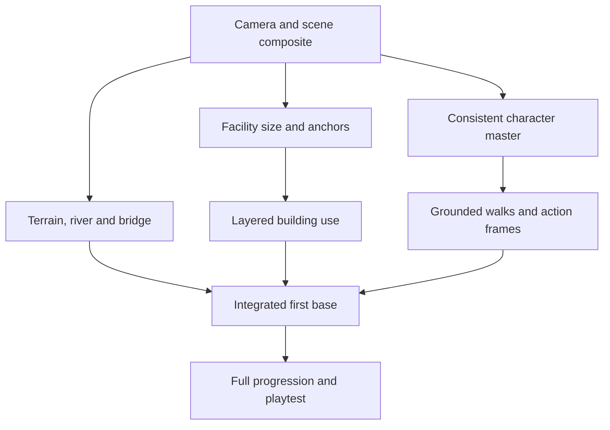

# Command Base — first-base delivery plan

**Decision document, 27 September 2026.** This is the work map for finishing the *first base*, from a new visitor at the gate through a full roster, built facilities, training, missions, saved progress and a legible living environment. It supersedes the order-of-work instructions in the original `CLAUDE_IMPLEMENTATION/README.md`; briefs 01–04 have been implemented, while brief 05 describes the next visible-interaction target. The current beta is playable, but its landscape is flatter than the art target and its people use directional stills for walking.

## What “first base working” means

On one authored alpine map, the player can admit a visitor, recruit/name the same person, build and upgrade all available facilities, see soldiers **walk and actually use** training and needs stations, dispatch four mission tiers, return to a saved base after a real-time absence, and complete the first-base objective without losing soldiers or progress. This is a complete local playable base, **not** a promise that promotion, other bases, accounts or monetisation are built. A public release has a separate playtest and device gate at the end.

The rendered base must convey the original illustrated reference: irregular meadow and dirt, substantial rocks and cliff faces, an obvious river and bridge, curved paths, larger recognisable buildings, and people whose actions are readable at the default 960 × 576 camera. The bridge must connect real walkable banks if it appears to invite a crossing; otherwise do not show a false route. `WORLD` is 1600 × 960, the camera moves over it, and the current person height is 44 world pixels. Review screenshots at default zoom; a large attractive asset can fail when reduced.

## Responsibilities and handoff

| Work | Codex (art direction and assets) | Claude (game implementation) | Joint proof |
| --- | --- | --- | --- |
| Lock one visual target | Maintain `art/FIRST_BASE_ASSET_LIST.md`, supplied references, palette, camera and 960 × 576 target composite; reject inconsistent sources. | Capture current and target-sized game frames; report exact world placement and art size/anchor requirements before integration. | Approve one screenshot showing gate, river edge, bridge, entrance, barracks, range, four people and readable UI. |
| World and bridge | Make separable cliff, bank, water, bridge and path-edge layers; clean seams, alpha and scale. | Fit them to `WORLD.terrain` without changing saves; set camera framing, depth order and bridge route/collision; keep build sites, paths and water consistent. | New and fully built screenshots show terrain shape; route and pointer tests pass; a soldier either crosses a real bridge or the bridge is clearly non-accessible. |
| Buildings and gate | Finish each facility's `back/floor`, optional `roof`, `front`, props and fixed boom cutout; record entrance and activity anchors. | Own `js/asset-manifest.js`, crop/export pipeline, zone fit, build and upgrade visuals, gate animation, reveal/occlusion, click targets and service-worker list. | A unit can walk inside/behind front pieces, occupy the right station and remain selectable; no soldier stands on a roof. |
| People and activity | Supply one consistent soldier and civilian character master; create/clean registered frames or a rig render; keep uniform and face stable, with separate identity accent mask and effects. | Own state transitions, route speed/stride, sprite playback, local station paths and interruption/reload behavior. Do not simulate a climb by lifting a standing still. | Continuous clips show grounded walk, admission, range and obstacles; foot/hand contacts and identity survive transitions. |
| Scenery and UI | Supply static rock/vegetation/fence/bench/crate/equipment props as needed; review screenshot composition. | Place props deterministically with clearance, improve labels and HUD in code-native UI, preserve build affordances and mobile input. | No prop blocks a path or a station; fresh and expanded bases read clearly on desktop and portrait phone. |
| Gameplay and release checks | Review art/game-scale failures and produce replacement assets; join visual playtest review. | Keep economy/missions/save rules, automate meaningful regressions, run browser captures and fix bugs; manage integration branches and merge. | Full first-base progression, v1 save migration, offline catch-up, export/import, 20 soldiers and three outside playtests pass. |

**Repository coordination:** Claude owns `js/`, test/runtime code and the manifest. Codex owns new source art under `art/`, prepared static cutouts under `assets/props/` and art specifications. Codex may push art-only commits to `main` as already authorised; Claude pulls latest `main` before a feature branch or integration and reports which assets it promoted. For any change touching both code and art metadata, Claude proposes the anchor/size contract first and Codex supplies the reviewed pixels. Do not have two people independently rewrite `js/asset-manifest.js`. No item becomes “production” because it was generated or pushed; it passes the listed asset and game-scale gates.

## Dependency map

## Milestones and stop/go checks

| Gate | Claude builds | Codex supplies | Advance only when |
| --- | --- | --- | --- |
| **0. Baseline and visual contract** | Current browser screenshot/video at 960 × 576 and portrait; map camera coordinates; one target composition with actual zone boxes. | Art sheet of approved scale, camera, palette and reference examples; inventory below. | We can compare the same scene at the same zoom; no unexplained size mismatch. |
| **1. Living map** | Replace flat edge treatment with modular cliff/river/path overlays; show and route a bridge correctly; place nine prepared static props without blocking paths. | Clean/split the bank, bridge and transition studies, add missing seamless segments and static props. | Fresh and built screenshots show rocks/river/bridge; `validateWorld()` and camera/hit tests pass. |
| **2. One complete human loop** | Gate admission → waiting → recruit → walk → range slot → four-pose training → mission departure; gate arm and depth occlusion. | Same-character soldier and civilian directional walk/idle, range poses, checkpoint layers and accent mask. | 30-second continuous capture has planted steps, no hovering, consistent identity, visible range use, two simultaneous slots and a safe reload. **This is the highest art risk.** |
| **3. Facility kit** | Register all nine facilities, their entrance/station anchors, build/upgrade visuals, roof/front layers and queue/reveal rules. | Finish the nine named building sets, split furniture and station props; replace the five old-style facilities. | All nine fit legal irregular sites and are distinguishable without label bars; people use visible slots and remain selectable. |
| **4. Obstacles and remaining activities** | Implement tyre hops, vault, net ascent/crest/descent and beam balance from brief 05; lift, drill, wash, eat, rest and relax loops, with interruption semantics. | Same-character contact poses, net/front rails, equipment and activity effects as separate images. | Default-zoom clips prove each building-specific action; occupancy, departure and reload do not leave a suspended character or claimed slot. |
| **5. First-base completion and beta gate** | Full progression and save recovery, mission/hospital timers, build economy, mobile/desktop performance, service-worker cache, browser visual captures. | Repair art failures from gameplay footage and supply missing icon/prop variants only where needed. | New and migrated saves complete base 1; 20-unit stress, export/import and long absence pass; three fresh players can recruit/train/dispatch without explanation. |

Milestones 1 and character-master work in milestone 2 can run in parallel, but integration of activity art waits for the station anchor contract. Do not start a full set of costly character directions from another generated six-pose sheet: the earlier sheets repeat poses. Use a single consistent rig or controlled manual frame workflow, approve **one six-frame down walk at 44-pixel game height** and the corresponding idle, then derive the other directions and activities from the same master. If that check fails, revise the production method before multiplying frames.

**Animation escalation:** Codex owns the visual character master and poses; Claude owns an optional rig/render/export tool and runtime playback. If image generation plus cleanup cannot make six distinct coherent frames, switch to a controllable 2D/3D rig or specialist animation help at Gate 2 rather than calling repeated generated poses finished. This is the only material dependency that cannot be solved by promising more prompt iterations.

## Commands and review artifacts

Claude runs `node tests/smoke.cjs`, `node tests/ui-smoke.cjs`, `node tools/prepare-art.cjs`, `node tools/validate-assets.cjs` and real browser capture (`node tools/browser-capture.cjs <url> captures --clip`) for each visual integration. Validation may require Chrome/Edge installed locally. Each milestone includes a 960 × 576 fresh/built capture and, for motion, a continuous clip. The test suite proves rules; screenshots and clips prove visual behavior. Codex checks generated assets at native and game scale, fixes alpha fringes/pivots, and records source and readiness in `art/FIRST_BASE_ASSET_LIST.md`.

**Claude's next instruction:** pull `main`, read this plan, `art/FIRST_BASE_ASSET_LIST.md`, `art/ART_PRODUCTION_QUEUE.md` and Brief 05. Capture Gate 0, then implement Gate 1 and the character asset contract for Gate 2. Commit each gate in reviewable slices; tell Codex the exact world coordinates, image dimensions, pivots, doorway and slot locations needed for the next art export. Do not claim the first base is visually finished before the continuous clips pass.
